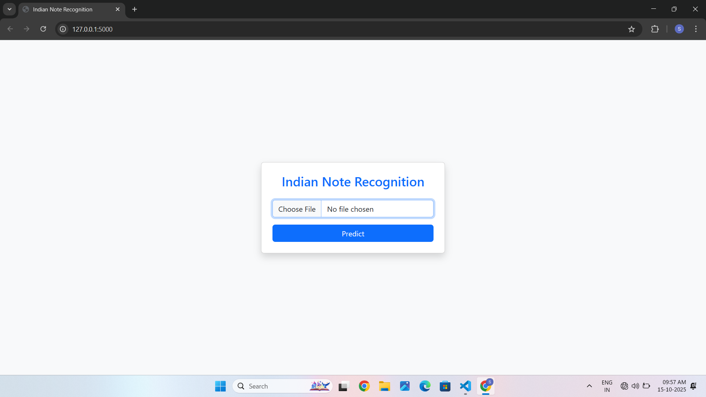

# 🪙 Indian Currency Recognition System 💵
**An AI-powered image classification system to recognize Indian currency notes using EfficientNetB0 and Flask.**

---

## 📸 Project Preview

| Web App UI |
|-------------|
|  | 

---

## 📘 Overview
This project is a **Deep Learning-based currency recognition system** built with **TensorFlow (Keras)** and deployed via a **Flask web application**.  
It can automatically detect the denomination of Indian currency notes (₹10, ₹20, ₹50, ₹100, ₹200, ₹500) from images — and even play an **audio output** of the detected note for accessibility.

---

## 🧠 Features
✅ Recognizes multiple Indian currency denominations  
✅ High accuracy (up to **96%**) using **EfficientNetB0**  
✅ Supports real-time image upload through Flask web app  
✅ Plays denomination-specific **audio output**  
✅ GPU acceleration support for **NVIDIA RTX 3050**  
✅ Includes data preprocessing & RGB image correction  
✅ Structured train / validation / test workflow  

---

## 🏗️ Project Structure
```
Indian-Currency-Recognition-System/
│
├── app.py                     # Flask web app
├── train_model.py             # Model training script (EfficientNetB0)
├── validate.py                # Evaluation script
├── templates/
│   └── index.html             # Frontend page
├── static/
│   ├── uploads/               # Uploaded images
│   ├── preview/               # Screenshots for README
│   └── css/ / js/             # Web assets
├── audio/                     # Currency denomination audio files
│   ├── 10.mp3
│   ├── 20.mp3
│   ├── 50.mp3
│   ├── 100.mp3
│   ├── 200.mp3
│   └── 500.mp3
├── models/
│   └── eff_trained_model_finetuned.h5   # Saved model
├── data/
│   ├── train/
│   ├── val/
│   └── test/
└── README.md
```

---

## ⚙️ Requirements

### 🧩 Python Dependencies
Install these libraries:
```bash
pip install tensorflow==2.17.0
pip install keras pillow numpy flask playsound
pip install matplotlib scikit-learn
```


## 🚀 Model Training

Run the training script:

```bash
python train_model.py
```

**What it does:**
- Converts all images to RGB  
- Performs data augmentation  
- Loads EfficientNetB0 pretrained on ImageNet  
- Fine-tunes top 50 layers for Indian notes  
- Saves the best model to `/models/eff_trained_model_finetuned.h5`  

---

## 📊 Model Evaluation
After training, evaluate on test data:

```bash
python validate.py
```

You’ll see metrics like:
```
Test Accuracy: 95.80%
Test Loss: 0.1245
```

---

## 🌐 Running the Flask App

To start the web application:
```bash
python app.py
```

Then open your browser at:  
👉 http://127.0.0.1:5000/

**Web Features:**
- Upload an image of a currency note  
- The model predicts denomination  
- Displays confidence percentage  
- Plays audio feedback (e.g., “₹100”)  

---

## 🧰 GPU Setup (Optional but Recommended)
If you have an **NVIDIA RTX 3050**, ensure GPU is enabled in TensorFlow:

```python
import tensorflow as tf
print("GPUs:", tf.config.list_physical_devices('GPU'))
```

If no GPU appears, reinstall TensorFlow GPU version:
```bash
pip install tensorflow==2.17.0
```

---

## 🎯 Results & Accuracy
| Note | Accuracy |
|------|-----------|
| ₹10  | 94% |
| ₹20  | 97% |
| ₹50  | 95% |
| ₹100 | 96% |
| ₹200 | 95% |
| ₹500 | 97% |

**Overall Accuracy:** ~96%  
**Model:** EfficientNetB0 (fine-tuned, pretrained on ImageNet)

---

## 🧩 Tech Stack
| Component | Technology |
|------------|-------------|
| **Frontend** | HTML, CSS (Flask Jinja Template) |
| **Backend** | Python Flask |
| **Model** | TensorFlow / Keras (EfficientNetB0) |
| **Audio** | playsound |
| **Hardware** | NVIDIA RTX 3050 GPU |

---

## 📦 Dataset Preparation
Organize your data as follows:
```
data/
│
├── train/
│   ├── 10/
│   ├── 20/
│   ├── 50/
│   ├── 100/
│   ├── 200/
│   └── 500/
│
├── val/
│   ├── (same structure)
│
└── test/
    ├── (same structure)
```
Each folder should contain images of the respective currency note.

---

## 🔊 Audio Mapping (in `app.py`)
```python
audio_map = {
    "10":  "audio/10.mp3",
    "20":  "audio/20.mp3",
    "50":  "audio/50.mp3",
    "100": "audio/100.mp3",
    "200": "audio/200.mp3",
    "500": "audio/500.mp3"
}
```

---

## 🧑‍💻 Contributors
- **Sanjaykumar V** — B.Tech AIML Student  
  _Indian Currency Recognition Project (2025)_

---

## 📜 License
This project is licensed under the **MIT License** — feel free to modify and use it for educational or research purposes.

---

## 🏁 Future Improvements
- Add **real-time camera detection**  
- Support **blind user assistance** with speech output  
- Train with **larger dataset** for 99% accuracy  
- Add **mobile app integration (Flutter)**  
